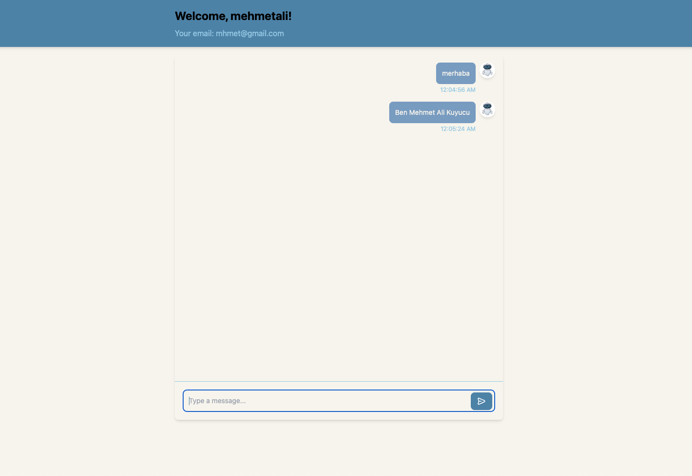

# Bolt Insight Study Project

## Important Note

I was unable to complete the project in time. My initial plan was to implement the backend using LangChain, OpenAI API, and a vector database, but I didn’t have enough time to finish it. Due to my current job and the fatigue from work, I couldn’t meet the deadline for the full-stack case study project.

## Project's Image

## Requirements

To run this project, you need to have the following installed on your machine:

- Docker
- Docker Compose

## Getting Started

1. **Clone the repository:**

    ```sh
    git clone https://github.com/mehmetalikuyucu/study-case.git
    cd study-case
    ```

2. **Start the services:**

    ```sh
    docker-compose up
    ```

    This will start the following services:
    - **client**: A Node.js application running on port 3000.
    - **server**: A NestJS application running on port 3003.
    - **db**: A MongoDB database running on port 27017.
    - **mongo-express**: A web-based MongoDB admin interface running on port 8081.

3. **Access the applications:**

    - Client: [http://localhost:3000](http://localhost:3000)
    - Server: [http://localhost:3003](http://localhost:3003)
    - Mongo Express: [http://localhost:8081](http://localhost:8081)

## Environment Variables

The following environment variables are used in the `docker-compose.yml` file:

- `MONGO_INITDB_ROOT_USERNAME`: The username for the MongoDB root user.
- `MONGO_INITDB_ROOT_PASSWORD`: The password for the MongoDB root user.
- `MONGO_INITDB_DATABASE`: The name of the initial database to create.
- `ME_CONFIG_MONGODB_ADMINUSERNAME`: The username for Mongo Express admin.
- `ME_CONFIG_MONGODB_ADMINPASSWORD`: The password for Mongo Express admin.
- `ME_CONFIG_BASICAUTH_USERNAME`: The username for basic authentication in Mongo Express.
- `ME_CONFIG_BASICAUTH_PASSWORD`: The password for basic authentication in Mongo Express.
- `ME_CONFIG_MONGODB_SERVER`: The MongoDB server address for Mongo Express.

## Volumes

The following volumes are defined in the `docker-compose.yml` file:

- `db-data`: Stores MongoDB data.
- `pgadmin-data`: Placeholder for future use.
- `node_modules`: Placeholder for future use.

## Networks

The following network is defined in the `docker-compose.yml` file:

- `network`: A custom network for the services to communicate.

## Health Checks

The `mongo-express` service includes a health check to ensure it is running correctly.

## Additional Commands

- **Stop the services:**

    ```sh
    docker-compose down
    ```

- **Rebuild the services:**

    ```sh
    docker-compose up --build
    ```

